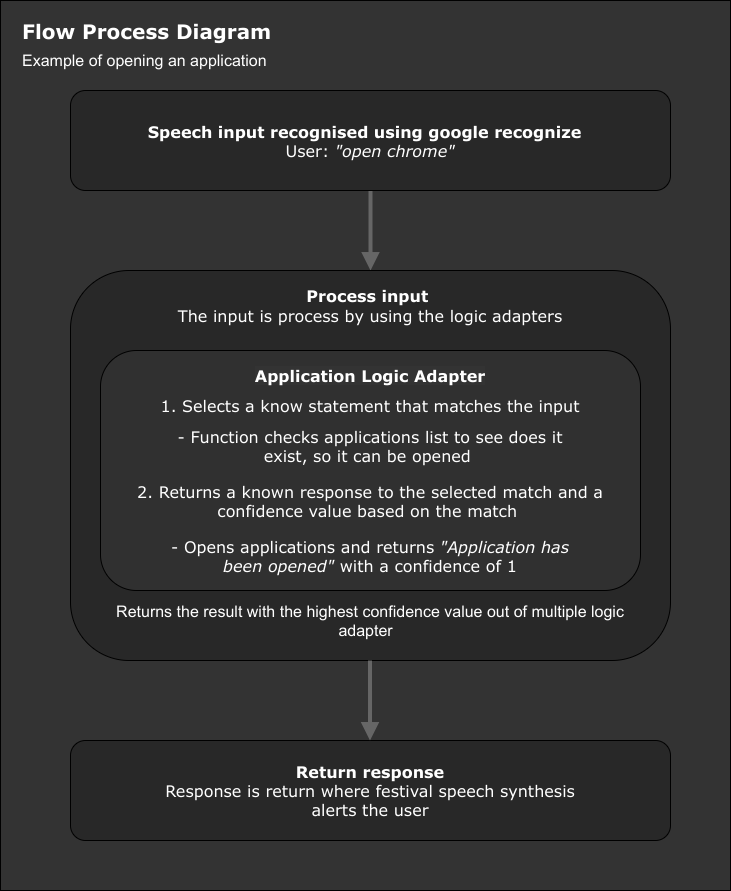

# Gesture Based UI Project  2020

## Developers: Morgan Reilly | Cathal Butler

## Nuton

### Table of contents
 * [The Project](#the-project)
 * [What is Nuton](#what-is-nuton)
 * [Commands](#commands)
 * [Architecture](#architecture)
 * [Environment Setup](#environment-setup----linux)
 * [Running The Application](#running-the-application)
 * [Testing & Development](#testing--development)
 * [Conclusion & Recommendation](#conclusion--recommendation)
 * [References](#references)

### The Project
#### Project Statement
*Develop an application with a Natural User Interface. There are a number of options available to
you and this is an opportunity to combine a lot of technology that you have worked with over the
past four years*

#### About The Project
The aim of this project was to create a gesture based application. This had initially intedended to be a basic arcade game,([similar to this](https://elgoog.im/t-rex/)), built through Unity with use of Microsofts Kinect, but had to be changed due to the hardware limitations and social restrictions after the outbreak of COVID-19. With the penultimate timeframe for the project looming we opted to create a voice controlled desktop application which was terminal operated. It incorporates the following technolgies:
   * [Chatterbot](https://chatterbot.readthedocs.io/en/stable/) | Machine Learning, conversational dialog engine.
   * [Speech Recognition](https://pypi.org/project/SpeechRecognition/) | Speech Recognition engine using the Google API.
   * [eSpeak](http://espeak.sourceforge.net/) | Open source speech synthesizer for English and other languages.
   * [mongodb](https://www.mongodb.com/) | Document store database used for storing Nutons statements.

### What is Nuton
Nuton is a bot that can interpret the voice commands you issue it. It does this by interpreting the speech input given by the user, processing that input through the use of application logic adapters, and then by returning the response in the form of speech-to-text. This is all stored on a mongodb database cluster hosted by [mlab](https://mlab.com/). The program first has to interperet what the user has vocalised, it does so by using [speech recognition through python](https://pypi.org/project/SpeechRecognition/), which is processed and stored for Nuton to consume. Nuton then uses the Chatterbot package to build and train itself. This query can then be handled by Nuton to open specific applications, to return information about the current time or [weather](https://openweathermap.org/current) in a specified location, and to create a to-do notes.

### Commands
  * Lunching applications - *"launch chrome"*
  * Lunching a website - *"open twitter"*
  * Making notes - *"make a note"* followed by what you want to take note of *"I have a meeting on tuesday"*
    - Replying a note - *"read my note"*
  * Temperature status - *"what temperature is it in Galway"*
  * Time - *"what time is it?"*
  * Maths - *"Whats five plus five?"*

### Architecture


* ### How Nuton Works
    * Nuton is created and trained using [Chatterbot](https://chatterbot.readthedocs.io/en/stable/) which is a Python machine learning, conversational dialog engine. A Chatterbot starts off with no knowledge of how to communicate but with the help of user input, corpus data and logic adapters, the bot can learn and return the correct response to the users input.

        
    
    * Chatterbot has a number of predefined logic adapters for handling input that you can implement to improve the bots capabilities. In our case with Nuton, three were used, four were developed.
        * Predefined
            - **BestMatch** - This handles what is the best adapter to respond based on the confidence value
            - **TimeLogicAdapter** - A logic adapter that returns the time
            - **MathematicalEvaluation** - A logic adapter that returns answers to maths question
        
        * Custom Adapters
            - **NotesAdapter** - Handles when a user wants to make a note or have a note read back to them
            - **WeatherAdapter** - A logic adapter that handles return the temperature or a city your request
            - **ApplicationAdapter** - A logic adapter that handles opens applications and websites
            - **HelperAdapter** - A logic adapter that handles return help and examples to the user when requested

* ### Text to Speech using [eSpeak](http://espeak.sourceforge.net/)
    * Nuton uses eSpeak as a voice for the bot to speak. eSpeak is an open-source speech synthesizer for English and other languages so it was a good fit for the application. For this to be a feature of the bot a function was created which just runs a subprocess to execute a command like you would within a terminal.
      
        ```python
         subprocess.run('echo "' + str(text) + '" | espeak', shell=True)  
        ```
        The command above that gets executed by a subprocess accepts a string of text which eSpeak will process and echo the text to speech. 

* ### How Nuton opens application
    * Having the bot open applications was a feature from the beginning that was going to be implemented but it came with its problems. While researching the best methods on how to do it became clear that it's not that simple.
    One suggestion found here on [StackExchange](https://askubuntu.com/questions/433609/how-can-i-list-all-applications-installed-in-my-system-) where a command would list all the `.desktop` apps inside `usr/share/applications`, which did return a list of installed applications, but ultimately wasn't feasible as different Linux distributions don't all have `.desktop` shortcuts in that locations.

    * Another approach which we examined was using the environment path for the application, so by just entering the applications name in a terminal it would launch. An alternative approach to this was to generate a bash-script. Again this was not feasible as not all Linux systems would have the paths set up for all applications. The bash script would require an initial set-up, which defeated the purpose.

    * The method that was implemented but could be improved on was to check on both operating systems that the application was developed on where the application binary file was located, which in our luck were the same directory `/usr/bin/`. 
    After discovering this, the `application_location.txt` file was populated with the name and directory location of the binary where python could now make a subprocess call to launch that application when a user requested an application to be opened. The only downside is that the file needs to be manually updated so, for now, the most popular applications you may find on an OS were added to the file to allow the user open them when they command the bot.
        - Support applications to open subject to work if installed & a list of websites that can be opened.
            
            |Apps    |Websites   |
            |--------|-----------|
            |Chrome  |Twitter    |
            |Kate    |Github     |
            |Konsole |Youtube    |
            |Firefox |Skynews    |
            |Spotify |Gmail      |
            |xTerm   |Outlook    |
            |Dolphin |Amazon     |
            |Code    |Reddit     |
            |Nautilus|Netflix    |

* ### Training
    *  Chatterbot has a wide array of corpus data files you can use to train the bot or you can specify your own one. In Nutons case the English corpus was used for training as well as some custom corpus data that works better with our custom logic adapters.

* ### Gesture Implementation With Hardware
    *  As the project statement states, *develop an application with natural user interacting* this was done by implementing a microphone into the program to record and analyise the users voice. This is done with [speech recognition through python](https://pypi.org/project/SpeechRecognition/), which analyzes the audio and returns the result as text. The text result would then be passed onto the Chatterbot to process and return a result.

* ### Database
    * Chatterbot by default uses SQLite, and has a number of database adapters built into it for use. In our case with Nuton, we used a mongodb database cluster hosted by [mlab](https://mlab.com/), which is a JSON document-store, was used which allows the training data, and the requests and responses, to be stored.

### Environment Setup -- Linux
* Download [requirements.txt](/requirements.txt)
* Create Virtual Environment
* `$ python3 -m venv venv`
* Activate Virtual Environment
* `$ source venv/bin/activate`
* Pip install packages
* `$ pip install -r requirements.txt`

### eSpeak
 * Ubuntu
    - `$ sudo apt-get install espeak`
    - Test `$ echo "Hello World." | espeak`
    - Hello World will be played back to you.
    
 * Manjaro / Arch Linux
    - `$ sudo pacman -S espeak`
    - Test `$ echo "Hello World." | espeak`
    - Hello World will be played back to you.

### Running The Application
* Assuming correct set up and activation of environment
* In the root level of the project directory:
* `$ cd chatbot/` 
* `$ python main.py`
    * Note: When running the application [ALSA](https://alsa-project.org/wiki/Main_Page) drivers and server may throw errors in the console, these errors can be ignored for the most part unless audio input or output does not work correctly. This can be tested by changing into the `tests` directory, and running `$ python audio_in_tests.py`.

### Testing & Development
This project was developed and tested on:
* #### Testing Environments
    * OS: [Manjaro Linux](https://manjaro.org/download/official/kde/) & [Ubuntu 19.10](https://ubuntu.com/)
    * Python 3.8.2
    * [PyCharm 2019.3.4 (Professional Edition)](https://www.jetbrains.com/pycharm/)
      - Build #PY-193.6911.25, built on March 18, 2020
* #### Test Cases 
    * Testing that was carried can be found here [nuton_test_cases.xlsx](/uploads/nuton_test_cases.xlsx)


### Conclusion & Recommendation
 * **Cathal Butler**
    - Overall I enjoyed this project, Morgan and myself initially were working on a game developed in Unity using a Kinect sensor we had on lend from the college but due to the outbreak of COVID-19 our plans had changed substantially. I feel we adapted very fast and worked well together to plan and develop Nuton, our project. We started out coming to grips with the packages we would need with Morgan working with [Speech Recognition](https://pypi.org/project/SpeechRecognition/) and myself researching [ChatterBot](https://chatterbot.readthedocs.io/en/stable/) and putting together a basic bot.
    Once we had gained an understanding of both packages it was just a matter of combining them and adding the text to speech. A recommendation which I talk about in the [How Nuton opens application]() is the process of locating binary files to run the applications. A few different method could have been used to solve this problem and our version
    could defiantly be improved but I feel for what is it now it gets the job done.

 * **Morgan Reilly**
    - This project made for a nice combination of a challenging task and research of technology which I normally wouldn't have looked at. I feel the proect could have been scoped with a better scrutiny from the beginning as we had full choice of any operating system and technology but I made a poor descion to work with a Windows specific piece of hardware/software when both of us were running Linux on our machines. There was definitely a lot of time lost in the acquisation of hardware and I feel this time could have been put to better use. In terms of work, project management, and development skills, Cathal has been great. He is consistent and reliable, and I'm glad to have worked alongside him. I think we both adapted well given the situation and final timeframe. Ultimately I'm glad to have worked on a speech recognition project, and my only regret is that we hadn't done so from the beginning.

### References
 * https://chatterbot.readthedocs.io/en/stable/index.html
 * https://github.com/Uberi/speech_recognition#readme
 * http://espeak.sourceforge.net/
 * https://realpython.com/python-speech-recognition/
 * https://cmusphinx.github.io/wiki/tutorial/
 * https://github.com/Uberi/speech_recognition/blob/master/reference/library-reference.rst
 * https://stackoverflow.com/questions/31603555/unknown-pcm-cards-pcm-rear-pyaudio
 * https://www.mongodb.com/
 * https://alsa-project.org/wiki/Main_Page
 * https://pypi.org/project/SpeechRecognition/
 * https://chatterbot.readthedocs.io/en/stable/
