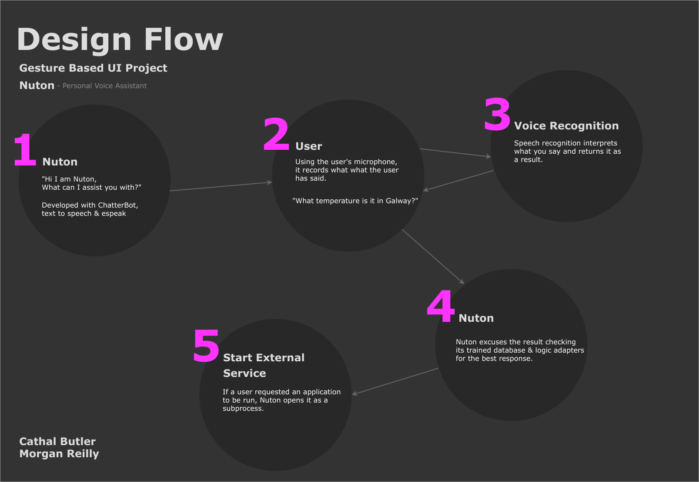

## Gesture Based UI Project  2020

### Developers: Morgan Reilly | Cathal Butler

### Project Statement
*Develop an application with a Natural User Interface. There are a number of options available to
you and this is an opportunity to combine a lot of technology that you have worked with over the
past four years*

### Table of contents
 * [The Project](#the-project)
 * [What is Nuton](#what-is-nuton)
 * [Commands]()
 * [Architecture]()
 * [Environment Setup]()
 * [Running The Application]()
 * [Testing & Development]()
 * [References]()

### The Project
This project was initially meant to be a Kinect game but was changed due to hardware limitations after the outbreak of COVID-19.
The aim for this project is to make something based around gesture based UI, after carrying out some research it was decided that a
personal voice assistant is what the project was going to be based on using 
   * [Chatterbot](https://chatterbot.readthedocs.io/en/stable/) | Machine Learning, conversational dialog engine.
   * [Speech Recognition](https://pypi.org/project/SpeechRecognition/) | Speech Recognition engine using the Google API.
   * [eSpeak](http://espeak.sourceforge.net/) | Open source speech synthesizer for English and other languages.
  
### What is Nuton
Nuton is your bot that will interpret voice commands you issue it. It does this with the help of the packages 
listed above. Nuton uses the Chatterbot package to build and train itself, it then ties in with the speech recognition
to interpret a command from a user with the aid of the google recognition API and that command is then process using the 
Chatterbot dataset and custom logic adapters designed to allow operations like opening applications, querying the weather 
and so on.

### Commands
  * Lunching applications - *"launch chrome"*
  * Lunching a website - *"open twitter"*
  * Making notes - *"make a note"* followed by what you want to take note of *"I have a meeting tuesday"*
    - Replying a note - *"read my note"*
  * Temperature status - *"what temperature is it in Galway"*
  * Time - *"what time is it?"*
  * Maths - *"Whats five plus five?"*

### Architecture



* ### How Nuton Works
    * Nuton is created and trained using [Chatterbot](https://chatterbot.readthedocs.io/en/stable/) a Python machine learning, 
    conversational dialog engine. A Chatterbot starts off with no knowledge of how to communicate but with the help
    of user input, corpus data and logic adapters, the bot can learn and return the correct response to the users input.
    
        
        
    * Chatterbot has a number of predefined logic adapters for handling input that you and implement to improve the bots capabilities which
    in Nuton case three were used, four were developed
        * Predefined
            - **BestMatch** - This handles what is the best adapter to respond based on the confidence value
            - **TimeLogicAdapter** - A logic adapter that returns the time
            - **MathematicalEvaluation** - A logic adapter that returns answers to maths question
      
        * Custom Adapters
            - **NotesAdapter** - Handles when a user wants to make a note or have a note read back to them
            - **WeatherAdapter** - A logic adapter that handles return the temperature or a city your request
            - **ApplicationAdapter** - A logic adapter that handles opens applications and websites
            - **HelperAdapter** - A logic adapter that handles return help and examples to the user when requested
        
    
        
* ### Text to Speech using [eSpeak](http://espeak.sourceforge.net/)
    * Nuton uses eSpeck for the bot to speak. eSpeak is an open-source speech synthesizer for English and other languages 
      so it was a good fit for the application. For this to be a feature of the bot a function was created which just 
      runs a subprocess to execute a command like you would within a terminal.
      
        ```python
         subprocess.run('echo "' + str(text) + '" | espeak', shell=True)  
        ```
        The command above that gets executed by a subprocess accepts a string of text which eSpeak will process and 
        echo the text to speech. 
        
* ### How Nuton opens application
    * Having the bot open applications was a feature from the beginning that was going to be implemented but it came
    with its problems. While researching the best methods on how to do it became clear that it's not that simple.
    One suggestion found here on [StackExchange](https://askubuntu.com/questions/433609/how-can-i-list-all-applications-installed-in-my-system-)
    where a command would list all the `.desktop` apps inside `usr/share/applications` which did return a list of install
    applications but wasn't feasible as different Linux distributions don't all have `.desktop` shortcuts in that locations.
   
   * Another approach that was looked into was hoping that an environment path was declared for the application so by
   just entering the applications name in a terminal it would lunch, again this was not feasible as not all Linux
   systems would have the paths set up for all applications.
   
   * The method that was implemented but could be improved on was to check on both operating systems that the application
   was developed on where the application binary file was located, which in our luck were the same directory `/usr/bin/`.
   After discovering this the `application_location.txt` file was populated with the name and directory location of the 
   binary where python could now make a subprocess call to lunch that application when a user requested an application
   to be opened. The only downside is that the file needs to be manually updated so, for now, the most popular applications
   you may find on an OS were added to the file to allow the user open them when they command the bot.
        - Support applications to open subject to work if installed & a list of websites that can be opened.
            
            |Apps    |Websites   |
            |--------|-----------|
            |Chrome  |Twitter    |
            |Kate    |Github     |
            |Konsole |Youtube    |
            |Firefox |Skynews    |
            |Spotify |Gmail      |
            |xTerm   |Outlook    |
            |Dolphin |Amazon     |
            |Code    |Reddit     |
            |Nautilus|Netflix    |
 
   
* ### Training
    *  Chatterbot has a lot of corpus data files you can use to train the bot or you can specify your own one. In Nutons case
    the English corpus was used for training as well as some custom coupes data that works better with custom logic adapters
  
* ### Gesture Implementation With Hardware
    *  As the project statement states, *develop an application with natural user interacting* this was done by 
    implementing a microphone into the program to record the user's voice. With the help of the Python Speech Recognition 
    engine, it analyzes the audio and return the result as text. The text result would then be passed onto the Chatterbot 
    to process it and return its result.
    
* ### Database
    * Chatterbot has a number of database adapter built into it, for Nuton case [MongoDB](https://www.mongodb.com/) 
    was used which allows all trained data to be stored there.

### Environment Setup -- Linux
* Download [requirements.txt](/requirements.txt)
* Create Virtual Environment
* `python3 -m venv venv`
* Activate Virtual Environment
* `source venv/bin/activate`
* Pip install packages
* `pip install -r requirements.txt`

### eSpeak
 * Ubuntu
    - `sudo apt-get install espeak`
    - Test `echo "Hello World." | espeak`
    - Hello World will be played back to you.
    
 * Manjaro / Arch Linux
    - `sudo pacman -S espeak`
    - Test `echo "Hello World." | espeak`
    - Hello World will be played back to you.

### Running The Application
* Assuming correct set up and activation of environment
* `cd chatbot` 
* `python main.py`
    * Note: When running the application [ALSA](https://alsa-project.org/wiki/Main_Page) drivers and server
    may throw errors in the console, these errors can be ignored for the most part unless audio input or output does
    not work correctly.

### Testing & Development
This project was developed and tested on
* #### Testing Environments
    * OS: [Manjaro Linux](https://manjaro.org/download/official/kde/) & [Ubuntu 19.19](https://ubuntu.com/)
    * Python 3.8.2
    * [PyCharm 2019.3.4 (Professional Edition)](https://www.jetbrains.com/pycharm/)
      - Build #PY-193.6911.25, built on March 18, 2020
* #### Test Cases 
    * Testing that was carried can be found here [nuton_test_cases.xlsx](/uploads/nuton_test_cases.xlsx)


### Conclusion & Recommendation
 * **Cathal Butler**
    - Overall I enjoyed this project, Morgan and myself initially were working on a game developed in Unity using a Kinect
    sensor we had on lend from the college but due to the outbreak of COVID-19 our plans had changed substantially. I feel
    we adapted very fast and worked well together to plan and develop Nuton, our project. We started out coming to grips with 
    the packages we would need with Morgan working with [Speech Recognition](https://pypi.org/project/SpeechRecognition/)
    and myself researching [ChatterBot](https://chatterbot.readthedocs.io/en/stable/) and putting together a basic bot.
    Once we had gained an understanding of both packages it was just a matter of combining them and adding the
    text to speech. A recommendation which I talk about in the [How Nuton opens application]() is the process of locating
    binary files to run the applications. A few different method could have been used to solve this problem and our version
    could defiantly be improved but I feel for what is it now it gets the job done.
    
 
 
 * **Morgan Reilly**
  
### References
 * https://chatterbot.readthedocs.io/en/stable/index.html
 * https://github.com/Uberi/speech_recognition#readme
 * http://espeak.sourceforge.net/
 * https://realpython.com/python-speech-recognition/
 * https://cmusphinx.github.io/wiki/tutorial/
 * https://github.com/Uberi/speech_recognition/blob/master/reference/library-reference.rst
 * https://stackoverflow.com/questions/31603555/unknown-pcm-cards-pcm-rear-pyaudio
 * https://www.mongodb.com/
 * https://alsa-project.org/wiki/Main_Page
 * https://pypi.org/project/SpeechRecognition/
 * https://chatterbot.readthedocs.io/en/stable/

